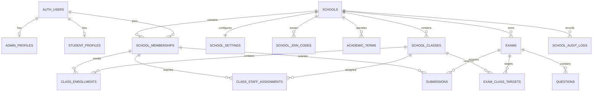

# Complete School Profile Implementation Plan

## Recommended architecture

The correct foundation is **not** a large `school_profiles` table attached to one administrator. Create a first-class `schools` tenant, then connect administrators, teachers, students, classes, exams, and results through `school_id`.

Core rules:

- A school is separate from the person who created it.
- `school_id` controls ownership and access.
- A school code is used only to join a school.
- Roles and memberships control what users can see.
- Individual, School, and General workspaces remain separate.
- No school authorization depends on browser storage or editable user metadata.

## 1. Current problems to fix

The current system has:

- `admin_profiles` containing only a username and school code.
- Students connected to a school through `localStorage`, not the database.
- No actual school name, profile, classes, staff, or membership records.
- Mock School dashboard data.
- Broad `allow_all_exams` and `allow_all_questions` database policies.
- A public policy that allows school-code lookup through `admin_profiles`.

Relevant existing code:

- `lib/authService.ts`
- `app/login/page.tsx`
- `components/CbtDashboard.tsx`

Those policies must be replaced before real school data is considered securely isolated.

## 2. Target relationship model



## 3. Tables to create

### `schools`

The main school profile and tenant record.

| Column | Purpose |
|---|---|
| `id uuid primary key` | Permanent internal school identifier |
| `name text not null` | Full display name |
| `short_name text` | Short header/mobile name |
| `slug text unique` | Future public URL |
| `logo_path text` | Storage path, not a hard-coded URL |
| `school_type text` | Primary, secondary, combined, tertiary, academy, or other |
| `description text` | Optional school description |
| `email text` | Official school email |
| `phone text` | Official contact number |
| `website text` | Optional website |
| `country_code text default 'NG'` | Country |
| `state text` | State |
| `city text` | City |
| `address_line1 text` | Private address |
| `timezone text default 'Africa/Lagos'` | Scheduling timezone |
| `status text` | `active`, `suspended`, or `archived` |
| `verification_status text` | `unverified`, `pending`, `verified`, or `rejected` |
| `is_profile_public boolean default false` | Future public-directory opt-in |
| `created_by uuid` | Auth user who created the school |
| `onboarding_completed_at timestamptz` | Whether setup is complete |
| `created_at`, `updated_at` | Audit timestamps |

Use `schools`, not `school_profiles`, because the school is an organization, not a user-profile extension.

### `school_settings`

One row per school for operational settings.

| Column | Purpose |
|---|---|
| `school_id uuid primary key` | References `schools` |
| `student_self_join_enabled boolean` | Whether students can join using a code |
| `default_result_visibility text` | Immediate, teacher release, or hidden |
| `default_locale text` | Default `en-NG` |
| `branding_primary_color text` | Optional branding |
| `created_at`, `updated_at` | Timestamps |

### `school_memberships`

The central authorization table.

| Column | Purpose |
|---|---|
| `id uuid primary key` | Membership identifier |
| `school_id uuid not null` | School |
| `user_id uuid not null` | Supabase Auth user |
| `role text not null` | `owner`, `admin`, `teacher`, or `student` |
| `status text not null` | `invited`, `active`, `suspended`, or `left` |
| `admission_number text` | Student-specific school number |
| `job_title text` | Optional staff title |
| `invited_by uuid` | Inviting user |
| `joined_at timestamptz` | Activation time |
| `created_at`, `updated_at` | Timestamps |

Constraints:

- Unique `(school_id, user_id)`.
- Unique active admission number within a school.
- A suspended or departed member retains historical results but loses access.
- Never delete a membership just because a student leaves; change its status.

A user can belong to more than one school, making future multi-school switching possible.

### `school_join_codes`

Moves the school code away from `admin_profiles`.

| Column | Purpose |
|---|---|
| `id uuid primary key` | Code record |
| `school_id uuid not null` | Owning school |
| `code text unique not null` | Random 8-10 character uppercase code |
| `purpose text` | Initially `student_join` |
| `is_active boolean` | Current validity |
| `expires_at timestamptz` | Optional expiry |
| `max_uses integer` | Optional limit |
| `uses_count integer default 0` | Redemption count |
| `created_by uuid` | Administrator who generated it |
| `revoked_at timestamptz` | Rotation/revocation time |
| `created_at` | Timestamp |

Important behavior:

- Only owners/admins can view or rotate codes.
- Students never receive database `SELECT` access to this table.
- Code validation runs through a rate-limited authenticated server endpoint.
- The endpoint creates a membership in one transaction.
- Rotating a code does not remove existing students.
- The code is never used in normal data queries after joining.

### `academic_terms`

| Column | Purpose |
|---|---|
| `id uuid primary key` | Term |
| `school_id uuid not null` | School |
| `academic_year text` | Example: `2026/2027` |
| `name text` | First, Second, or Third Term |
| `starts_on`, `ends_on` | Date range |
| `status text` | `draft`, `current`, or `closed` |
| `created_at`, `updated_at` | Timestamps |

Use a partial unique index so each school has only one `current` term.

### `school_classes`

| Column | Purpose |
|---|---|
| `id uuid primary key` | Class |
| `school_id uuid not null` | School |
| `academic_term_id uuid` | Active term/session |
| `name text` | Example: `SS2 A` |
| `level text` | Example: `SS2` |
| `arm text` | Example: `A` |
| `status text` | Active or archived |
| `created_at`, `updated_at` | Timestamps |

Use a unique class name per school and academic period.

### `class_enrollments`

Connects students to classes.

- `school_id`
- `class_id`
- `school_membership_id`
- `status`
- `enrolled_at`
- `left_at`

Use composite foreign keys or validation triggers to guarantee that the class and membership belong to the same school.

### `class_staff_assignments`

Controls which teachers can access which classes.

- `school_id`
- `class_id`
- `school_membership_id`
- `assignment_role`: lead teacher or subject teacher
- `subject`
- `created_at`

### `exam_class_targets`

Allows one assessment to target multiple classes.

- `school_id`
- `exam_id`
- `class_id`
- Unique `(exam_id, class_id)`

This replaces the current single free-text `class_level` approach.

### `school_invitations`

For inviting administrators and teachers.

- `school_id`
- `role`
- `invitee_email`
- `token_hash`
- `invited_by`
- `expires_at`
- `accepted_at`
- `revoked_at`

Invitation tokens should never be stored as plaintext.

### `school_audit_logs`

An immutable record of important actions:

- Profile changes
- Code rotations
- Staff invitations
- Role changes
- Student suspensions
- Assessment publishing
- Result releases

Columns should include `school_id`, `actor_user_id`, `action`, `entity_type`, `entity_id`, limited `metadata`, and `created_at`.

Do not store passwords, join codes, answer content, or unnecessary student information in audit metadata.

## 4. Existing tables to change

### `admin_profiles`

Keep it as the person's creator/admin profile:

- `id`
- `username`
- `full_name`
- `avatar_path`
- `is_general_admin`
- Optional `last_active_school_id`

Move `school_code` out after migration. One administrator may eventually manage multiple schools.

### `student_profiles`

Keep this as the student's global identity:

- `id`
- `username`
- `display_name`
- Optional avatar

Do not add a single `school_id` here. School relationships belong in `school_memberships`.

### `exams`

Add:

- `scope`: `individual`, `school`, or `general`
- `school_id`, required when scope is `school`
- `created_by`
- `academic_term_id`
- `starts_at`
- `ends_at`

Workspace separation:

- Individual: `scope = individual`, `school_id = null`
- School: `scope = school`, `school_id` populated
- General: `scope = general`, `school_id = null`

No exam should automatically appear in multiple workspaces.

### `questions`

- Questions attached to an exam inherit the exam's ownership.
- Standalone school question-bank items get `school_id`.
- Individual items use `created_by`.
- General questions remain global.
- Remove the current broad `allow_all_questions` policy.

### `submissions`

Add:

- `school_id` as a validated school snapshot for fast reporting
- `school_membership_id`
- `class_id`
- `attempt_number`
- `student_name_snapshot`
- `class_name_snapshot`

The snapshots preserve the historical result if a student changes name or class. School IDs must be derived from the exam and never trusted directly from client input.

## 5. Data-sharing rules

| Data | Owner | Admin | Teacher | Student | Public |
|---|---:|---:|---:|---:|---:|
| School name/logo/basic identity | Full | Full | Read | Read | Only if opted in |
| Address/contact/settings | Full | Full | Limited | No | No |
| Join codes | Manage | Manage | No | No | No |
| Staff and role management | Full | Most | No | No | No |
| Classes | Full | Full | Assigned classes | Own classes only | No |
| Student roster | Full | Full | Assigned students | Own record only | No |
| Draft assessments | Full | Full | Own/assigned | No | No |
| Published class assessments | Full | Full | Assigned | Assigned to student | No |
| School results | Full | Full | Assigned classes | Own results only | No |
| Individual creator exams | Creator only | No automatic access | No | No | If separately published |
| General practice exams | General admin | No | No | Read published | Read published |
| Audit logs | Full | Read | No | No | No |

Students should not be able to list classmates or view another student's results.

## 6. Security and RLS plan

Every new public-schema table must have:

1. Explicit privilege revocation.
2. Only necessary grants restored.
3. RLS enabled.
4. Separate `SELECT`, `INSERT`, `UPDATE`, and `DELETE` policies.
5. Both `USING` and `WITH CHECK` on updates.
6. Indexes on all foreign keys and RLS filtering columns.

Supabase requires particular care around explicit Data API exposure and table grants. New tables may not be automatically available through the API. Grants and RLS must be included in the same migration.

Create private authorization helpers such as:

- `private.is_school_member(school_id)`
- `private.has_school_role(school_id, roles[])`
- `private.can_manage_class(class_id)`

They must check `auth.uid()`, have a fixed empty `search_path`, and not rely on `user_metadata`. Authorization roles live in `school_memberships`.

Immediately remove during cutover:

- `allow_all_exams`
- `allow_all_questions`
- Public `admin_profiles` school-code verification
- Duplicate permissive profile policies
- Any client-exposed general-admin credentials

## 7. Logo and file storage

Create a `school-branding` Storage bucket.

Path format:

```text
{school_id}/logo/{generated_filename}
```

Rules:

- Owners/admins can upload, update, and delete.
- School members can read.
- Public reading is allowed only for schools with public profiles.
- Validate file type, dimensions, and maximum size.
- Store only the object path in `schools.logo_path`.
- Upsert policies require `INSERT`, `SELECT`, and `UPDATE`.

## 8. School onboarding flow

After an administrator creates an account:

1. Create the Supabase Auth user and `admin_profiles` record.
2. Show "Create your school."
3. Collect school identity and location.
4. Create the `schools` row.
5. Create an owner `school_memberships` row.
6. Create the first academic term.
7. Generate the first student join code.
8. Optionally create classes.
9. Mark `onboarding_completed_at`.
10. Open the real School workspace.

Creation should be atomic through a carefully restricted database function or authenticated server endpoint so partial schools are not left behind.

## 9. Student joining flow

1. Student signs in normally.
2. Student enters a school code.
3. A rate-limited authenticated endpoint validates the active code.
4. It creates or reactivates a student membership.
5. It records code usage and an audit event.
6. The student selects their school if they belong to multiple schools.
7. All future access uses membership and `school_id`, not the code or `localStorage`.

Browser storage may remember the selected school as a convenience, but it must never grant authorization.

## 10. Replacing the mock dashboard

Map each dashboard item to real data:

- **School name/logo:** `schools`
- **Administrator name:** `admin_profiles`
- **Active students:** active student memberships
- **Classes:** `school_classes`
- **Live assessments:** school exams with `status = Live`
- **Average score:** average validated submission percentage
- **Needs grading:** submissions with pending theory grading
- **Assessment activity:** latest school exams
- **Class performance:** submissions grouped by class
- **Recent results:** published exam results
- **Notifications:** omit until a real notification table exists

Fake values should become honest empty states such as "No classes created yet," never zero-looking sample data.

## 11. Migration strategy

Use an expand-backfill-switch-contract rollout:

1. Back up and test in a staging Supabase project.
2. Create the new tables, constraints, indexes, grants, RLS, and policy tests.
3. Create one `schools` row for each existing admin profile.
4. Copy each existing `school_code` into an active join-code record.
5. Create an owner membership for each existing administrator.
6. Add nullable `school_id`, `scope`, and `created_by` columns to existing records.
7. Backfill existing non-general exams using their current school code.
8. Backfill school memberships for students who already submitted to that school's exams.
9. Ask students without inferable history to enter their code once again.
10. Keep `school_code` compatibility reads temporarily.
11. Deploy application code using the new tables.
12. Remove permissive policies and enable strict tenant isolation.
13. Make required columns non-null after verifying backfill counts.
14. Remove legacy `school_code` columns from admin, exam, and question tables.
15. Refresh the schema snapshot and run database advisors.

Existing non-general exams should migrate into the School workspace because students currently reach them through a school code. Any exam intended to be personal can be reclassified manually afterward.

## 12. Required indexes

At minimum:

- `school_memberships(user_id, status)`
- `school_memberships(school_id, role, status)`
- Unique active admission numbers by school
- `school_join_codes(code)` for active codes
- `academic_terms(school_id)` with one-current-term partial index
- `school_classes(school_id, status)`
- `class_enrollments(class_id, status)`
- `class_enrollments(school_membership_id)`
- `class_staff_assignments(school_membership_id, class_id)`
- `exams(school_id, status, created_at desc)`
- `exam_class_targets(class_id, exam_id)`
- `submissions(school_id, submitted_at desc)`
- `submissions(exam_id, student_id)`
- `questions(exam_id, order_index)`

All foreign-key columns should be indexed.

## 13. Implementation phases

### Phase 1: Security foundation

- Inventory current grants and policies.
- Add RLS policy tests.
- Design strict Individual, School, and General scope rules.
- Remove client-exposed administrative credentials.
- Prepare the secure join-code redemption mechanism.

### Phase 2: School tenant and profile

- Create `schools`, `school_settings`, memberships, join codes, terms, and audit logs.
- Build atomic school creation.
- Add school onboarding and profile editing.
- Add school logo upload.

### Phase 3: Classes and people

- Create classes, class enrollments, and staff assignments.
- Build student membership redemption.
- Build staff invitations and role management.
- Add member suspension and departure handling.

### Phase 4: Assessment ownership

- Add exam scope, `school_id`, creator, and term fields.
- Add class targeting.
- Update question ownership.
- Attach submissions to memberships and classes.
- Separate Individual, School, and General queries.

### Phase 5: Real School dashboard

- Replace all mock values with database queries.
- Add real empty, loading, and error states.
- Connect assessment, class, student, and result navigation.
- Remove the Mock Data badge and hard-coded school identities.

### Phase 6: Migration and cleanup

- Backfill existing schools, owners, exams, and inferable student memberships.
- Run a compatibility period.
- Remove broad legacy policies and code-based ownership.
- Remove deprecated columns only after verification.

## 14. Verification and acceptance criteria

Before releasing:

- An owner from School A cannot access any School B row.
- A teacher cannot access unassigned classes.
- A student cannot view another student or result.
- Anonymous users cannot enumerate schools or codes.
- General practice exams remain publicly readable but not publicly writable.
- Rotated codes stop working immediately.
- Existing memberships continue working after code rotation.
- Individual exams never appear in School mode.
- Dashboard values survive reloads and come from the database.
- No `Northbridge College`, fake names, fake results, or `Mock data` badges remain.
- Migration row counts match before and after backfill.
- RLS tests run for every role using pgTAP or equivalent database tests.
- Database advisors, lint, type checking, and the production build pass.

## 15. Implementation order

Implement this plan in the following order:

1. Security foundation
2. School tenant and profile
3. Memberships and secure joining
4. Academic terms and classes
5. Exam ownership and class targeting
6. Real dashboard data
7. Existing-data migration
8. Legacy cleanup

This order establishes authorization before real school and student data begins flowing through the new dashboard.

## Official references

- [Supabase Row Level Security](https://supabase.com/docs/guides/database/postgres/row-level-security)
- [Securing the Supabase Data API](https://supabase.com/docs/guides/api/securing-your-api)
- [Supabase Storage access control](https://supabase.com/docs/guides/storage/security/access-control)
- [Supabase database testing](https://supabase.com/docs/guides/local-development/testing/overview)
- [Supabase breaking-change changelog](https://supabase.com/changelog?types=breaking-change)
